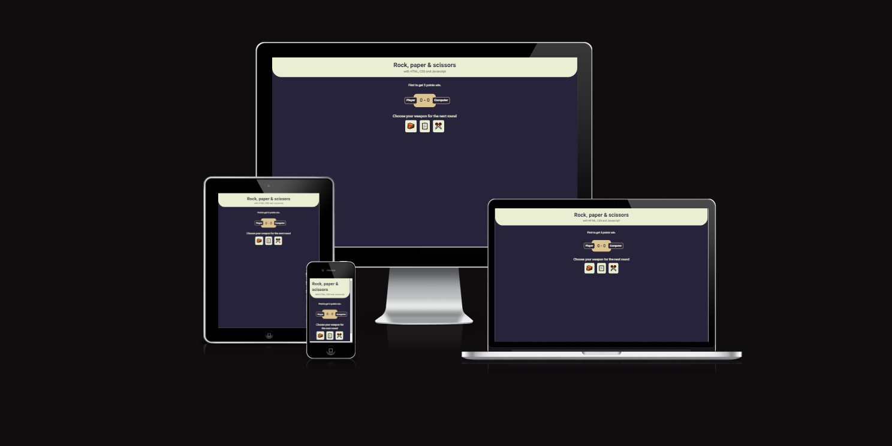
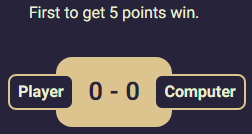
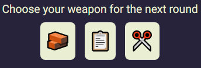

# Rock, paper & scissors

This website is designed for an exclusive expierence where you will enjoy the game that every single one of us has played as a child. 
Rock, paper & scissors is a game developed in HTML, CSS and JavaScript. 
This game will let you see the potential that these programming laguages have.
It is also an entertaining game in which you can spend unlimited hours on.

## Features 

### Existing Features

- __The Rock, Paper & Scissors Heading__

  - Featured at the top of the page, the Rock, paper & scissors heading is easy to see for the user. Upon viewing the page, the user will be able to see the name of the game.

- __The Score Area__

  - This section will allow the user to see the score. The user will be able to see the results after each round.
  - The user will be able to see the rules of the game. 

- __The Weapons section__

  - This section will allow the user to play the game. The user will be able to easily see icons for rock, paper and scissor.
  - The user will be able to select the type of weapon they will be playing by clicking on the different icons.

## Testing 

- I tested that the page works in different browsers such as: Chrome, Internet Explorer and Safari.
- I have assured that the heading, score and weapons sections are all redeable and easy to comprehend.

### Validator Testing 

- HTML
    - No errors were returned when passing through the official [W3C validator](https://validator.w3.org/nu/?doc=https%3A%2F%2Fbenyaminmn.github.io%2Frock-paper-scissors%2F)
- CSS
    - No errors were found when passing through the official [(Jigsaw) validator](https://jigsaw.w3.org/css-validator/validator?uri=https%3A%2F%2Fbenyaminmn.github.io%2Frock-paper-scissors%2F&profile=css3svg&usermedium=all&warning=1&vextwarning=&lang=es)
- JavaScript
    - No errors were found when passing through the official [Jshint validator](https://jshint.com/)
      - The following metrics were returned: 
      - There are 6 functions in this file.
      - Function with the largest signature take 1 arguments, while the median is 0.
      - Largest function has 21 statements in it, while the median is 3.
      - The most complex function has a cyclomatic complexity value of 20 while the median is 1.

### Unfixed Bugs

- No bugs were found.

### Accessibility 

- I confirmed that the colors and fonts chosen are easy to read and accessible by running it through "lighthouse" in devtools.

## Deployment

This section should describe the process you went through to deploy the project to a hosting platform (e.g. GitHub) 

- The site was deployed to GitHub pages. The steps to deploy are as follows: 
  - In the GitHub repository, navigate to the Settings tab.
  - On the setting selection to the left, select "Pages".
  - From the source section drop-down menu, select the Master Branch.
  - Once the master branch has been selected, the page will be automatically refreshed with a detailed ribbon display to indicate the successful deployment. 

The live link can be found here - https://benyaminmn.github.io/rock-paper-scissors/

## Credits 

### Content 

- The text for the game was taken from https://fonts.google.com/.
- A lot of help and ispiration were taken from https://www.w3schools.com/.

### Media

- The emojis were taken from Microsoft's deafult emoji browser.
